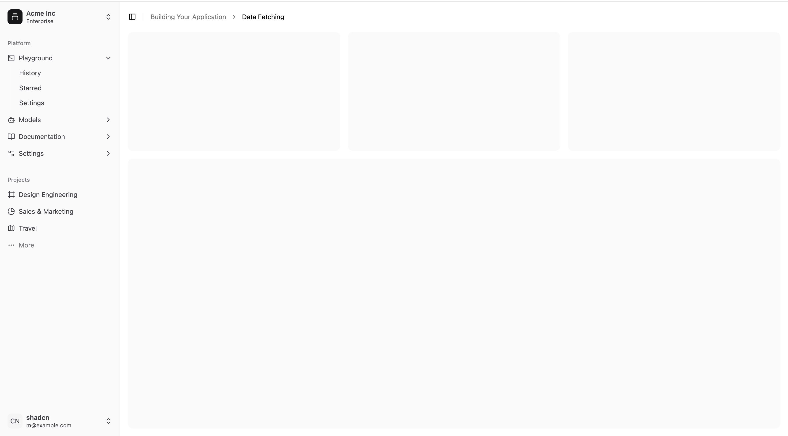

# ShadCN Dashboard

This is a modern dashboard built with [ShadCN UI](https://ui.shadcn.com/) and React, featuring a sleek and responsive layout with various UI components like buttons, alerts, sidebars, and more.



## Features

- **Sidebar Navigation**: Fully responsive sidebar for easy navigation between different sections.
- **Responsive Design**: Works seamlessly on both desktop and mobile devices.
- **UI Components**: Built using ShadCN UI components, including buttons, alerts, modals, and more.
- **Dark/Light Mode**: Switch between dark and light modes for a personalized experience.

## Installation

To get started with the project, follow these steps:

### 1. Clone the repository

```bash
git clone https://github.com/hameed-fu/shadcn-dashboard.git
cd shadcn-dashboard
